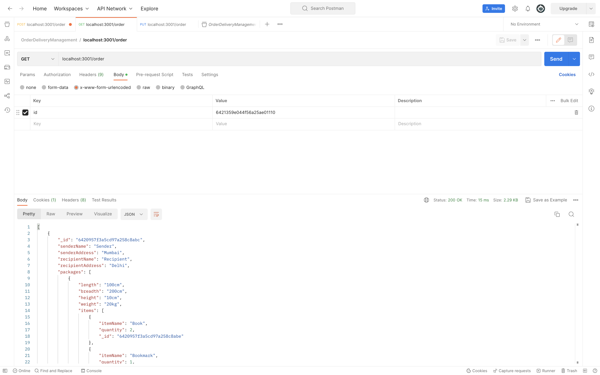
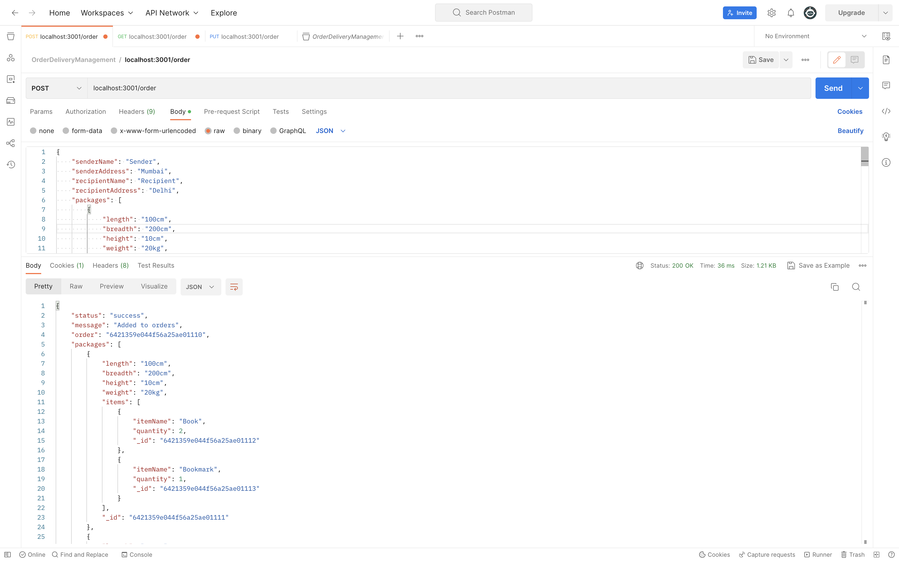
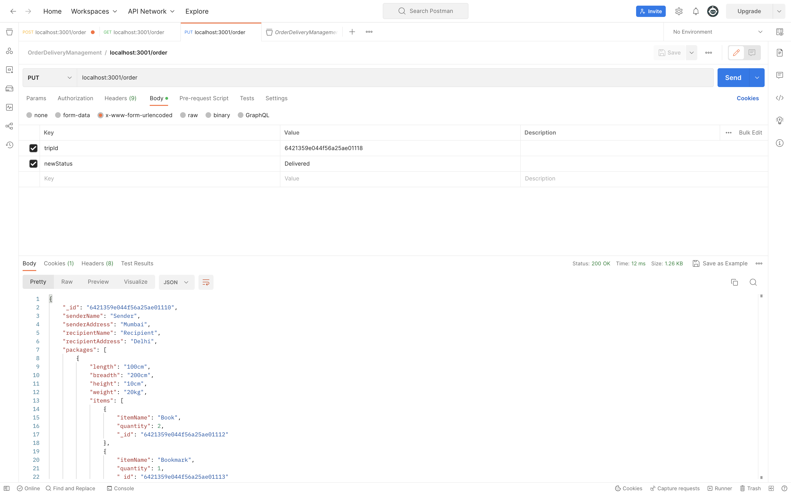

# OrderDeliveryManagement
A Simple API used to create orders, manage order phases (trips), and view order information

### Instructions

Install all the required dependencies<br>
`npm i`

Create a .env file to add the mongodb Database Information

Add the database url to the .env file. (Usually "mongodb://localhost:27017/" or a remote atlas DB)<br>
`DATABASE_URI="<database_url>"`


Run the server using the following command<br>
`npm run dev`


### API Endpoints

The following are the API endpoints

| HTTP Verbs | Endpoints | Action |
| --- | --- | --- |
| GET | /order | To view all the orders of the model |
| POST | /order | To create a new order |
| PUT | /order | To change the status of any particular trip phase |

The following are the example of request formats


* `GET` request without any body will return all the orders present 
* `GET` request with the parameter `orderId` will return the Order details and every trip and package in it 

POSTMAN Image attached


* `POST` request without any body will return error
* `POST` request with the parameters for order addition will return `success` and order details 

POSTMAN Image attached


* `PUT` request without any body will return error
* `PUT` request will require the parameters `tripId` and `newStatus` for updating the trip status and will return order details 

The only possible Trip status' are "Not started",
"Out for pickup",
"In transit",
"Out for delivery",
"Delivered",

POSTMAN Image attached



## The following is the sample JSON for an order, its packages, their Items and trips

```json
{
    "senderName":"Sender",
    "senderAddress":"Mumbai",
    "recipientName":"Recipient",
    "recipientAddress":"Delhi",
    "packages":[
        {
            "length":"100cm",
            "breadth":"200cm",
            "height":"10cm",
            "weight":"20kg",
            "items":[
                {
                    "itemName":"Book",
                    "quantity":2
                },
                {
                    "itemName":"Bookmark",
                    "quantity":1
                }
            ]
        },
        {
            "length":"100cm",
            "breadth":"200cm",
            "height":"10cm",
            "weight":"20kg",
            "items":[
                {
                    "itemName":"Book",
                    "quantity":2
                },
                {
                    "itemName":"Bookmark",
                    "quantity":1
                }
            ]
        }
    ],
    "trips":[
        {
            "shipper":"Amazon",
            "startLocation":"Mumbai",
            "endLocation":"Pune",
            "tripStatus":"In transit"
        },
        {
            "shipper":"Amazon",
            "startLocation":"Pune",
            "endLocation":"Nagpur",
            "tripStatus":"Not started"
        },
        {
            "shipper":"Amazon",
            "startLocation":"Nagpur",
            "endLocation":"Delhi",
            "tripStatus":"Not started"
        }
    ]
} 
```


### Technologies Used
* [NodeJS](https://nodejs.org/) This is a cross-platform runtime environment built on Chrome's V8 JavaScript engine used in running JavaScript codes on the server. It allows for installation and managing of dependencies and communication with databases.
* [ExpressJS](https://www.expresjs.org/) This is a NodeJS web application framework.
* [MongoDB](https://www.mongodb.com/) This is a free open source NOSQL document database with scalability and flexibility. Data are stored in flexible JSON-like documents.
* [Mongoose ODM](https://mongoosejs.com/) This makes it easy to write MongoDB validation by providing a straight-forward, schema-based solution to model to application data.
